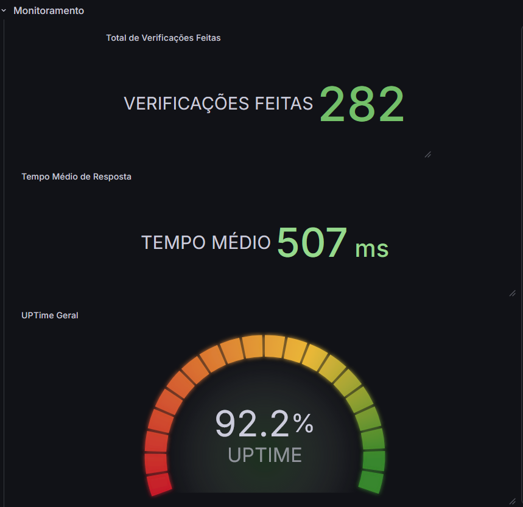
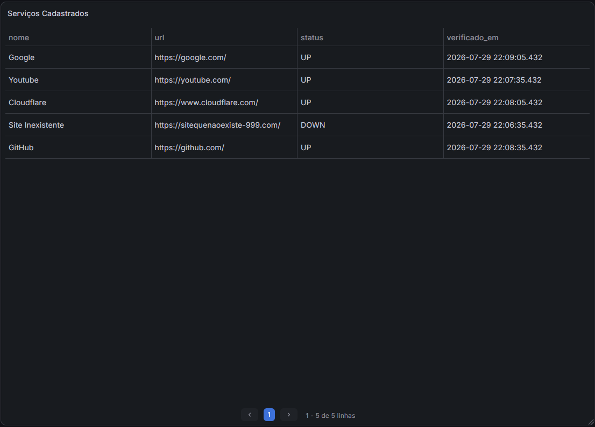
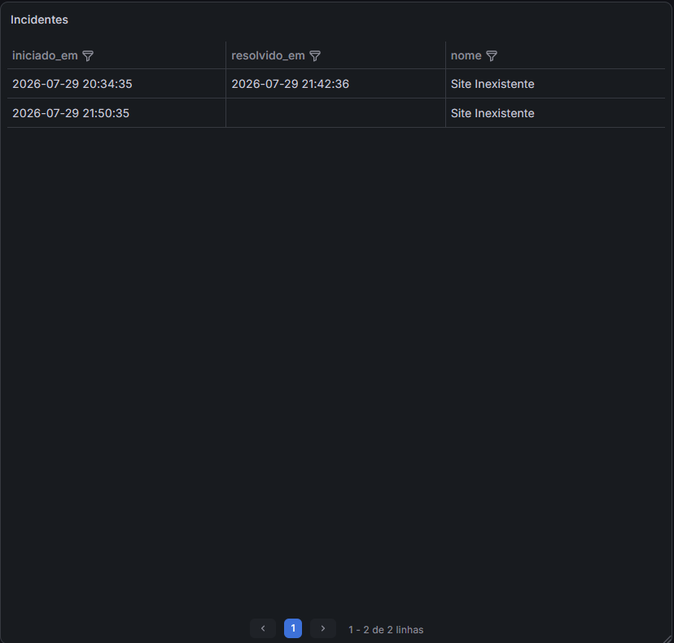
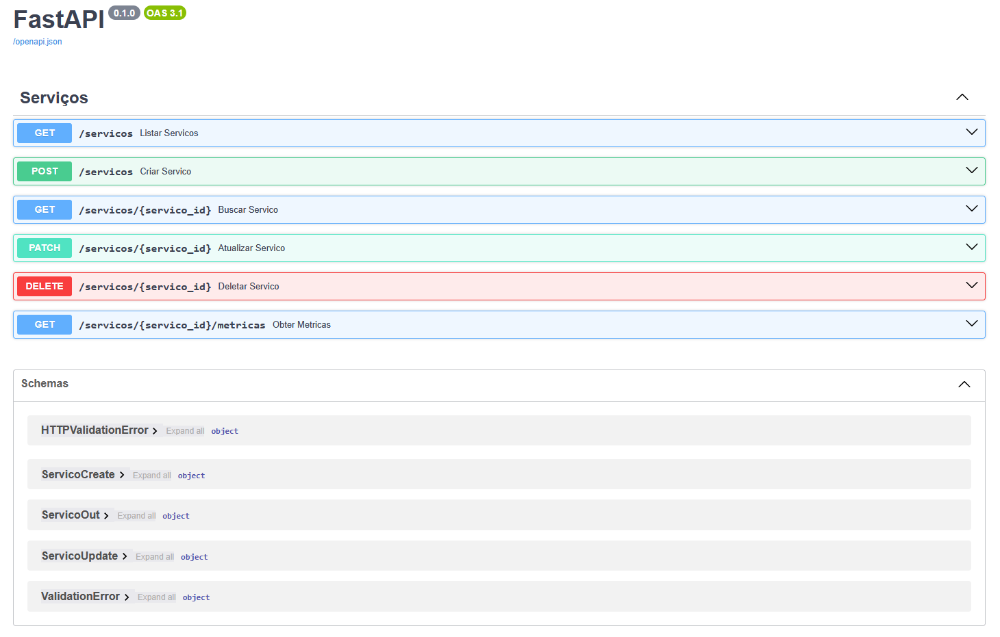

# Watchdog — API de Monitoramento de Serviços

Watchdog é uma API para monitorar a disponibilidade de serviços web. Você cadastra as URLs que quer acompanhar e o sistema verifica cada uma no intervalo configurado, guardando o histórico das verificações, registrando os períodos de indisponibilidade e calculando métricas como uptime e tempo médio de resposta.

O projeto está em desenvolvimento e foi construído como estudo de backend, banco de dados e infraestrutura.

## Visão geral

Dashboard de monitoramento no Grafana, lendo direto do banco:



Status atual de cada serviço e histórico de incidentes:





Documentação interativa da API, gerada automaticamente pelo FastAPI:



## Stack

| Camada | Tecnologia |
|---|---|
| API | Python 3.14, FastAPI, Uvicorn |
| Banco de dados | PostgreSQL 18 (Docker) |
| ORM e migrations | SQLAlchemy 2.0, Alembic |
| Verificações HTTP | httpx |
| Agendamento | APScheduler |
| Configuração | pydantic-settings + `.env` |
| Testes | pytest |
| Gerenciador de projeto | uv |
| Infraestrutura | Docker Compose |

Próximos passos previstos: containerização da própria API, dashboards no Grafana e verificação de renderização com Playwright.

## Funcionalidades

- Cadastro, listagem, edição e remoção de serviços monitorados
- Verificação HTTP de cada serviço, com registro de status, latência e código de resposta
- Agendador que verifica cada serviço no seu próprio intervalo, sem intervenção manual
- Histórico completo de verificações
- Detecção de incidentes: o sistema registra quando um serviço cai e quando volta
- Métricas por serviço: percentual de uptime e tempo médio de resposta
- Validação das URLs no cadastro e na edição
- Suíte de testes automatizados cobrindo as rotas e o cálculo das métricas

## Como rodar

Pré-requisito: [Docker](https://www.docker.com/).

```bash
git clone https://github.com/WillianAssufi/monitoramento-servicos.git
cd monitoramento-servicos

# copie o exemplo e ajuste usuário e senha
copy .env.example .env

# sobe tudo: banco e API
docker compose up -d --build
```

O banco e a API sobem juntos em containers. A API aplica as migrations automaticamente ao iniciar, então não há passo manual — depois do `up`, a documentação interativa já está disponível em http://localhost:8000/docs.

### Desenvolvimento local

Para rodar a API fora do container (com reload a cada alteração), é preciso ter o [uv](https://docs.astral.sh/uv/). Suba apenas o banco pelo Docker e rode a API localmente:

```bash
docker compose up -d db
uv sync
uv run alembic upgrade head
uv run uvicorn app.main:app --reload
```

Para rodar os testes (exige um banco de teste; veja `.env.example`):

```bash
uv run pytest
```

## Estrutura

```
monitoramento-servicos/
├── app/
│   ├── main.py          # aplicação FastAPI e ciclo de vida do scheduler
│   ├── config.py        # leitura das variáveis de ambiente
│   ├── database.py      # engine, sessão e Base do SQLAlchemy
│   ├── models.py        # tabelas (Servico, Verificacao, Incidente)
│   ├── schemas.py       # contratos de entrada e saída da API
│   ├── verificador.py   # verificação HTTP de uma URL
│   ├── scheduler.py     # varredura periódica dos serviços
│   └── routers/
│       └── servicos.py  # rotas de serviços e métricas
├── tests/               # testes com pytest
├── alembic/versions/    # migrations
├── Dockerfile           # imagem da API
├── docker-compose.yml   # orquestra API e PostgreSQL
└── pyproject.toml
```

## Notas de implementação

Algumas decisões que vale a pena explicar:

**API síncrona.** O trabalho mais pesado (bater nas URLs) roda no agendador, em segundo plano, e não no ciclo de requisição e resposta. Como o CRUD é leve, adotar `async` traria complexidade sem resolver um gargalo real.

**Agendador sem estado.** Em vez de manter um job por serviço em memória — que se perde quando a aplicação reinicia e exige manter o agendador em sincronia com o CRUD — o sistema faz uma varredura periódica que consulta o banco e decide quais serviços estão vencidos. O banco é sempre a fonte da verdade.

**Tudo em containers.** A API e o banco rodam como serviços separados no mesmo Compose, cada um com sua responsabilidade e seu ciclo de vida. Dentro da rede do Docker, a API encontra o banco pelo nome do serviço. As migrations são aplicadas automaticamente quando o container da API inicia, de modo que um `docker compose up` deixa o ambiente pronto para uso, sem etapas manuais.

**Datas em UTC.** As colunas de data usam `timestamptz` e o código grava com `datetime.now(timezone.utc)`. O container do Postgres roda em UTC e a máquina de desenvolvimento em outro fuso; padronizar tudo em UTC evita inconsistências. A conversão para o fuso local é responsabilidade de quem exibe.

**Incidentes por transição de estado.** Uma sequência de verificações com falha representa um único incidente, não vários. O sistema abre um incidente quando um serviço passa de no ar para fora do ar e o encerra quando ele volta, identificando o incidente aberto pela ausência de data de resolução.

**Dados sem invenção.** Quando um serviço não responde, o código HTTP e o tempo de resposta ficam nulos, e não com valores fictícios que distorceriam o histórico. As exceções de rede são capturadas de forma específica, sem um `except` genérico que esconderia outros erros.

**Segredos fora do versionamento.** As credenciais ficam no `.env`, que não é versionado. O `docker-compose.yml` referencia as variáveis em vez de conter as senhas, o que permite manter o repositório público.

## Autor

Willian Assufi. Projeto de estudo com foco em backend Python e infraestrutura.
